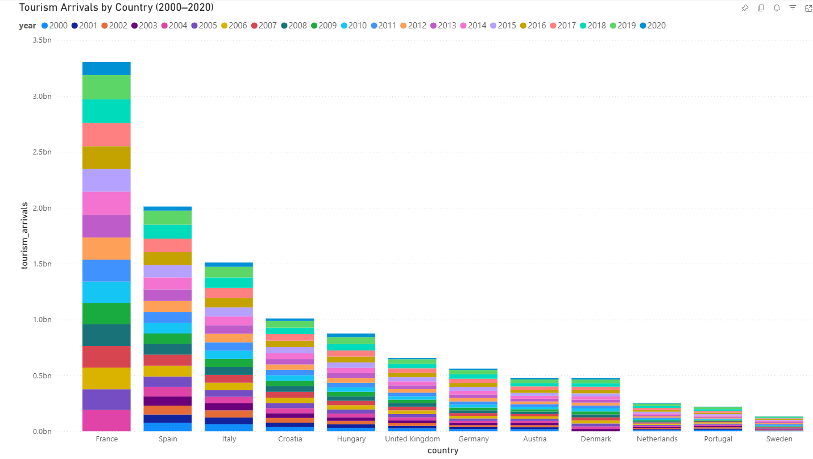
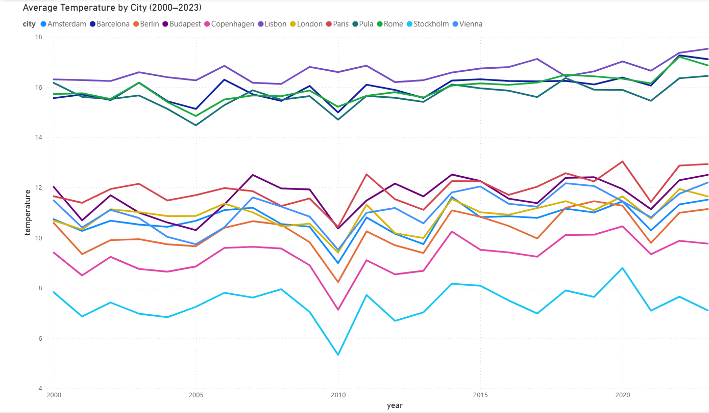
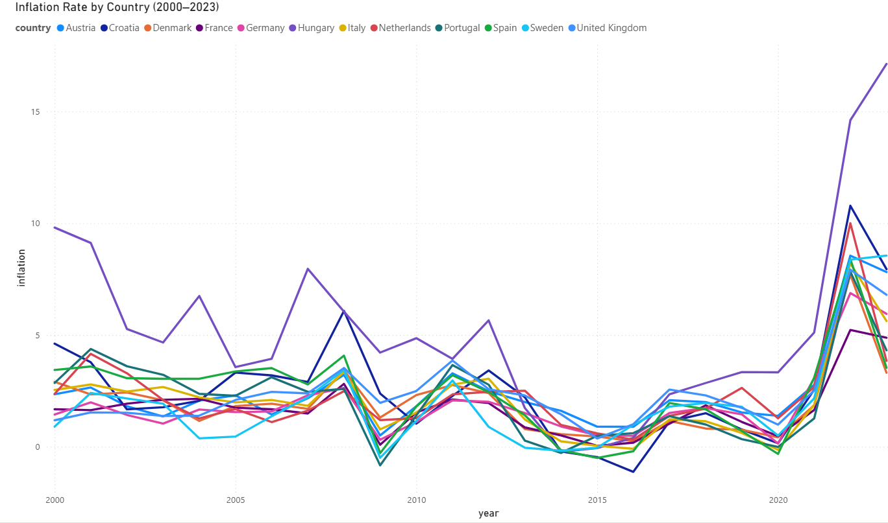
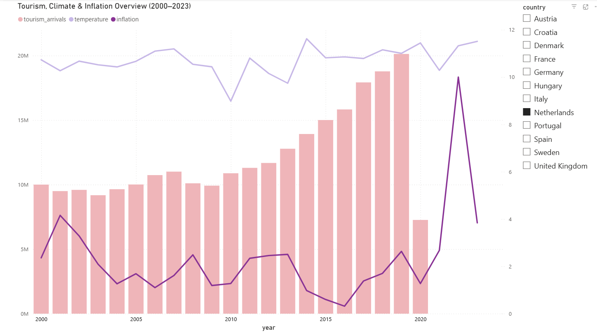

# European Tourism & Economy Analysis - Microsoft Fabric Portfolio

🇯🇵 日本語版はこちら → [README_JP.md](README_JP.md)

## Overview

A Microsoft Fabric Lakehouse data engineering project that integrates tourism, weather, and economic data from multiple sources into a unified analytics platform.

### Technology Stack

Microsoft Fabric Lakehouse | PySpark | Spark SQL | Delta Lake | Open-Meteo API | Power BI

## Objective

To design and implement a multi-source data integration platform using Microsoft Fabric Lakehouse, covering API-based data ingestion, CSV data processing, data transformation, and reporting.

## Countries & Cities

| Country | City |
|---------|------|
| Netherlands | Amsterdam |
| France | Paris |
| United Kingdom | London |
| Germany | Berlin |
| Italy | Rome |
| Spain | Barcelona |
| Sweden | Stockholm |
| Denmark | Copenhagen |
| Austria | Vienna |
| Portugal | Lisbon |
| Croatia | Pula |
| Hungary | Budapest |

## Data Sources

- **Kaggle**: World Tourism Economy Data (tourism arrivals, GDP, inflation by country)
  - Period: 2000–2020 (tourism arrivals), 2000–2023 (inflation)
- **Open-Meteo Archive API**: Historical daily temperature data for 12 European cities
  - Period: 2000–2023

> **Note:** Tourism arrivals data (2021–2023) is not available in the source dataset due to data collection gaps following COVID-19.

## Architecture

Medallion Architecture (Bronze / Silver / Gold)

### Bronze

- Raw CSV file from Kaggle loaded into Delta table (`bronze_tourism`)
- Temperature data fetched from Open-Meteo Archive API in city groups and saved as Delta table (`bronze_temperature`)

### Silver

- Filtered to 12 European countries by country code
- Selected and renamed columns for analytical use (`silver_tourism`)
- Temperature data required no transformation and was used directly from Bronze

### Gold

- Joined tourism, temperature, and inflation data on `country_code` and `year`
- Stored as a single analytical table (`gold_european_analysis`)

## Technical Highlights

- Designed and implemented an end-to-end data platform using Microsoft Fabric Lakehouse, from multi-source data ingestion to Power BI reporting
- Integrated heterogeneous data sources: REST API (Open-Meteo) and CSV (Kaggle) into a unified Delta Lake table
- Fetched historical temperature data for 12 European cities (2000–2023) via Open-Meteo Archive API using PySpark
- Implemented Medallion Architecture (Bronze / Silver / Gold) using Delta Lake tables
- Developed data transformation and JOIN logic using PySpark and Spark SQL
- Designed a single-table Gold layer optimized for Power BI reporting

## Visualization

## Data Model

| Column | Description |
|--------|-------------|
| country | Country name |
| city | Representative city |
| year | Year |
| tourism_arrivals | International tourist arrivals |
| gdp | GDP (current USD) |
| avg_temperature | Annual average temperature (°C) |
| inflation | Inflation rate (%) |

## Business Insights

- Tourism arrivals dropped sharply in 2020 due to COVID-19, with data unavailable for 2021–2023 in the source dataset
- Croatia ranked 4th in tourism arrivals among the 12 countries (after France, Spain, and Italy), which is notable given its smaller economy
- No strong correlation was observed between average temperature and tourism arrivals — France ranked 1st despite having a moderate climate
- A significant temperature dip was recorded across all cities in 2010, consistent with the historically cold European winter of 2009–2010 driven by a negative phase of the North Atlantic Oscillation (NAO)
- Hungary experienced a sharp rise in inflation from 2021 onward, reaching the highest inflation rate among all 12 countries in 2022–2023
